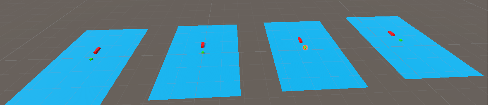
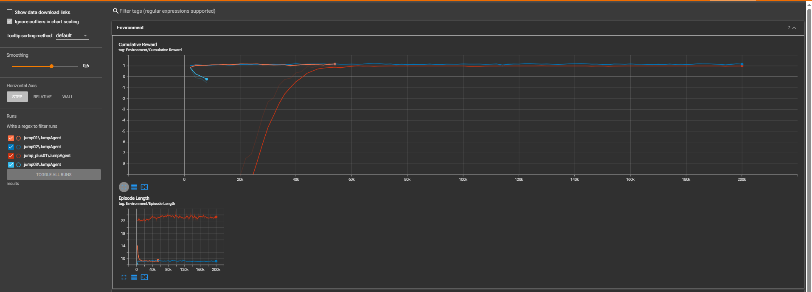

# Jumping Agent – Unity ML-Agents Project

---

### Overzicht

In dit Unity-project wordt een `JumpAgent` getraind via reinforcement learning (ML-Agents) om obstakels te vermijden, beloningen te verzamelen en succesvol een traject af te leggen. De agent leert te springen, te bewegen en zich aan te passen aan willekeurige configuraties van de omgeving.

---

###️ Set-up

1. **Omgeving**:
   - De agent staat op een platform met bewegende obstakels (horizontaal of verticaal).
   - Obstakels en beloningen worden dynamisch gegenereerd in willekeurige richtingen.
   - Zorg ervoor dat de obstakelobjecten de juiste tags hebben: `reward`, `obstacle`, `floor`.

2. **Agent**:
   - Het gedrag wordt geregeld via het script `JumpingAgent.cs`.
   - De agent heeft een rigidbody nodig en moet geplaatst worden op het platform.
   - Belangrijke parameters:
     - `jumpForce`: bepaalt de springkracht.
     - `moveSpeed`: bepaalt de snelheid links/rechts.
     - `gravityMod`: voor aangepaste zwaartekracht.

3. **ObstacleChecker**:
   - Een triggerobject op het einde van het traject roept `EndReached()` aan op de agent wanneer het succesvol eindpunt bereikt wordt.

4. **Setting layers**
	- Plane -> Floor
	- Agent -> Default
	- Cube -> Obstacle
	- Stopmuur1 -> Finish
	- Stopmuur2 -> Finish

---

###  Doel

De agent moet:
- Obstakels ontwijken
- Beloningssferen verzamelen
- Het einde van het level bereiken zonder fouten
- Leren hoe en wanneer te springen of bewegen

---

###  Reward Functie

| Gebeurtenis                  | Beloning     |
|-----------------------------|--------------|
| Beloning geraakt            | +0.7         |
| Succesvol einde             | +1.5         |
| Springen                    | -0.01        |
| Obstakel geraakt            | -1.0         |
| Van platform vallen         | -1.0         |

---

###  Observations & Actions

- **Observaties**:
  - Is de agent op de grond (`isGrounded`)
  - Eigen positie (`transform.localPosition`)
  - Type random item (via `RandomItemType`)

- **Acties**:
  - **Continue actie**: links/rechts bewegen
  - **Discrete actie**: springen (0 = niks, 1 = springen)

---

De agent `jump02` toont duidelijke en snelle convergentie richting hoge rewardwaarden en consistente episode-lengte:

- Stabiele rewards vanaf ~35k stappen
- Episode length rond 22 frames: teken van consistente, succesvolle gedragspatronen

---

